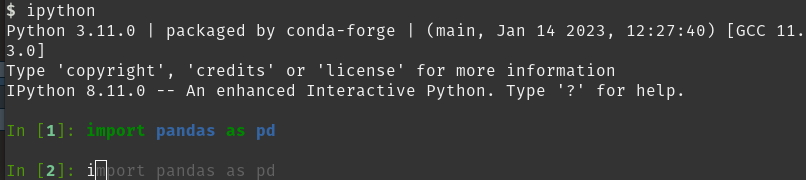
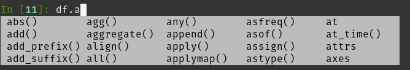
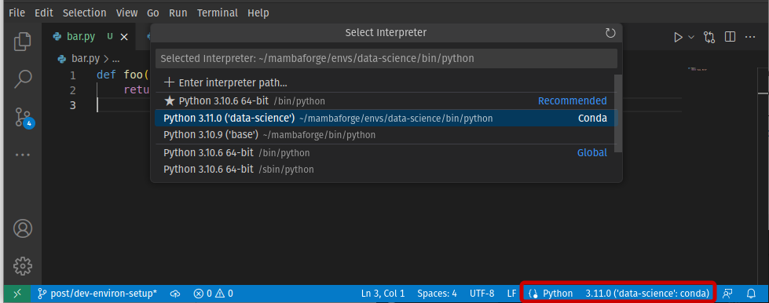

```{r message=FALSE, warning=FALSE, include=FALSE}
knitr::opts_chunk$set(fig.align = "center", out.width="100%", echo = FALSE)
```

Programming for Data Analysis can be quite different in some aspects of "traditional" software development.
At first, you don't expect a specific input (dependent variables, or features) and you must iterate a lot until you get a satisfactory output (predictions of a model).
There is a lot more exploring.
Often you stop typing to ask yourself:

- "What is the mean of variable $X$?"
- "How the distribution of values looks like?"
- "How the models' performance compare?"

You are very much likely to fail on your earlier assumptions.
This is normal, but you should -- to borrow a system design concept -- [fail fast](https://en.wikipedia.org/wiki/Fail-fast).
You want to iterate quickly over analysis and visualizations to better understand the data set you are dealing with.
Also, you want to test different algorithms to select the best for the problem in question.

Therefore, the development workflow in Data Science tends to be quite different from traditional software too.
Quick iteration is one of the reasons why interpreted languages (like Python and R) are used way more often than compiled languages in Data Science.
We should take the most out of this by configuring our development environment properly.

[RStudio](https://support--rstudio-com.netlify.app/products/rstudio/) and [Spyder](https://www.spyder-ide.org/) are quite similar in their workflow:
you have text editing for scripts, an iterative shell for running code, a panel for displaying plots, data frame inspector, all integrated for you.
RStudio is focused on R and Spyder, while a great Python IDE for Data Science, does not have the best interface (yet?).
Another popular IDE for Data Science is JupyterLab, but it is way more focused on notebooks and needs a lot of tinkering for be a good development environment for scripts.

Then, there is the well-known [Visual Studio Code](https://code.visualstudio.com/), or VS Code for short, that is used for many programming languages and purposes.
It is not an out-of-box IDE for Data Science like the previous ones, but its versatility is worth it.

There are quite a number of VS Code extensions for Data Science (like [Jupyter](https://code.visualstudio.com/docs/python/jupyter-support-py)).
But on this post, I will show how to configure [IPython](https://ipython.readthedocs.io/en/stable/index.html) in VS Code for an enhanced interactive Python shell and kernel.

# IPython overview

IPython adds many features on top of the default Python shell, like auto-completion, input history, and "magic commands" to control the environment or perform tasks.
It is also highlights syntax, so that is nice.
By using the Python shell efficiently, you are very likely to change your workflow and be more productive.

After integrating it to my development environment, I barely see a reason to use Jupyter notebooks.
The exception would be for presenting reports with plots and tables, or for educational purposes.
You can easily explore and inspect objects on the terminal and, after getting the hang of it, it is faster than running cells.

## Example usage

Suppose you started to explore your data and you have the following Python script,

```python
import pandas as pd

df = pd.DataFrame({"x": [1, 2, 3], "y": ["a", "a", "b"]})
```

When integrated to the VS Code terminal, you can run selected lines with <kbd>Shift</kbd> + <kbd>Enter</kbd>.
Running it the first time will start an IPython shell in your terminal.
You can also open the Command Palette (<kbd>Ctrl</kbd> + <kbd>Shift</kbd> + <kbd>P</kbd>) and select _Python: Start REPL_.

```python
In [1]: import pandas as pd
   ...:
   ...: df = pd.DataFrame({"x": [1, 2, 3], "y": ["a", "a", "b"]})
```

Before writing any more code to your script, you can explore your data set in the IPython console.

```python
In [2]: df
Out[2]:
#    x  y
# 0  1  a
# 1  2  a
# 2  3  b

In [3]: df.describe()
Out[3]: 
#          x
# count  3.0
# mean   2.0
# std    1.0
# min    1.0
# 25%    1.5
# 50%    2.0
# 75%    2.5
# max    3.0

In [4]: df["y"].value_counts()
Out[4]: 
# a    2
# b    1
# Name: y, dtype: int64
```

You can also type `?` after an object to inspect it.

```python
In [5]: df?

# Type:        DataFrame
# String form:
#    x  y
# 0  1  a
# 1  2  a
# 2  3  b
# Length:      3
# File:        ~/mambaforge/envs/data-science/lib/python3.11/site-packages/pandas/
# core/frame.py
# Docstring:  
# Two-dimensional, size-mutable, potentially heterogeneous tabular data.
```

Figures \@ref(fig:ipython-history) and \@ref(fig:ipython-tab-completion) show auto-completion features of IPython that allows you to type less.

```{r ipython-history, fig.link="ipython-history.png", fig.cap="Command history cache in IPython. You can navigate the history with arrows keys or get completion for previous commands.", echo=FALSE}

```

```{r ipython-tab-completion, fig.link="ipython-tab-completion.png", fig.cap="Tab completion in IPython. Start typing and press <kbd>Tab</kbd> to get options of objects or methods that match the text.", echo=FALSE}

```

## IPython _vs_ Jupyter console

Yes, [JupyterLab console](https://jupyterlab.readthedocs.io/en/stable/user/code_console.html)
and [VS Code's interactive window](https://code.visualstudio.com/docs/python/jupyter-support-py)
are effectively an IPython console.
However they share the same flaw: they are associated with a single `.py` or `.ipynb` file.

This makes *all* the difference.
It induces you to work on a single file.
Even while exploring and testing, you should be thinking how to organize modules at different files.

# Setting up IPython in VS Code

First, make sure you have the VS Code's [Python extension](python-extension) installed.

You also need to install `ipython` package in your Python environment.
It is good practice to create an isolated environment to work on each project.
There are many environment managers for Python, like [`venv`](https://docs.python.org/3/library/venv.html) and [Conda](https://docs.conda.io/en/latest/).

```bash
# virtualenv
python -m venv /path/to/venv
source /path/to/venv/bin/activate
pip install ipython

# Conda
conda create --name my-env python=3.9 ipython
conda activate my-env
```

Figure \@ref(fig:python-environment) shows how to select the interpreter from this environment when working on your files.
You can also press <kbd>F1</kbd> (or <kbd>Ctrl</kbd> + <kbd>Shift</kbd> + <kbd>P</kbd>) and search *Python: Select Interpreter*.


```{r python-environment, fig.link="python-environment.png", fig.cap="Selecting the Python interpreter in VS Code.", echo=FALSE}

```

Now set launch arguments to open an IPython session instead of the default Python terminal. Open VS Code settings file:
<kbd>F1</kbd> (or <kbd>Ctrl</kbd> + <kbd>Shift</kbd> + <kbd>P</kbd>) > *Preferences: Open User Settings (JSON)*

```json
{
    ...,
    "python.terminal.launchArgs": [
        "-m",
        "IPython",
    ],
    ...
}
```

## IPython profiles

IPython can use multiple profiles, with separate configuration and history.
By default, if you don’t specify a profile, IPython always runs in the default profile.

Profiles have a configuration file which you can use to [customize IPython options](https://ipython.readthedocs.io/en/stable/config/options/terminal.html).
If you don't have one yet (usually at `~/.ipython/profile_default/ipython_config.py`), you may create it with

```bash
# Create an IPython profile by name
# If `profilename` is empty, use the default profile
$ ipython profile create [profilename]

# Check config file's location
$ ipython locate profile [profilename]
```

Use `--profile` option in VS Code settings to select a non-default profile.

```json
{
    ...,
    "python.terminal.launchArgs": [
        "-m",
        "IPython",
        "--profile",
        "profilename"
    ],
    ...
}
```

## Auto-reloading modules

Imagine you have a Python module, `bar.py`, with some useful functions you will reuse on other script.

```python
# bar.py
def foo():
    return "Hello World"
```

```python
In [1]: from bar import foo

In [2]: foo()
Out[2]: 'Hello World'
```

Now suppose that you make some change to `foo()` function in the `bar.py` file.

```python
# bar.py
def foo():
    return "Hey, you"
```

You would like that to be updated in your IPython session too, because you want to be iterative with your code.
However, that is not the default behavior.

```python
In [3]: from bar import foo

In [4]: foo()
Out[4]: 'Hello World'
```

If you are not working at a single gigantic Python file or Jupyter notebook that does everything but instead building a maintainable [modular code](https://en.wikipedia.org/wiki/Modular_programming),
it would be too troublesome and time-consuming to close the terminal, reopen IPython and reload functions/classes from modules every time there are changes.
When exploring data or models it is even worse, since you have to reload data or maybe re-run a training step.

Fortunately, there is an built-in extension called [`autoreload`](https://ipython.org/ipython-doc/3/config/extensions/autoreload.html) to change that behavior (and with some flexibility).

> `%autoreload 2`
> Reload all modules (except those excluded by `%aimport`) every time before executing the Python code typed.
  
```python
In [5]: %load_ext autoreload

In [6]: %autoreload 2

In [7]: foo()
Out[7]: 'Hey, you'
```

The argument `2` tells `autoreload` to reload all modules every time before executing the Python code typed.
You can automate this step with your IPython configuration file so you don't need to repeat the commands at every session start up.

Open your profile's configuration file (`ipython_config.py`) and change/add these lines:.

```python
## A list of dotted module names of IPython extensions to load.
#  Default: []
c.InteractiveShellApp.extensions = ["autoreload"]

## lines of code to run at IPython startup.
#  Default: []
c.InteractiveShellApp.exec_lines = ["%autoreload 2"]
```

# tl;dr

1. Make sure VS Code's [Python extension](python-extension) is installed.
1. Create a Python environment and install `ipython`. Select it as Python interpreter in VS Code.
1. Open VS Code settings: <kbd>F1</kbd> > *Preferences: Open User Settings (JSON)*
1. Set `python.terminal.launchArgs` to run IPython:
   ```json
   {
       ...,
       "python.terminal.launchArgs": [
           "-m",
           "IPython"
       ],
       ...
   }
   ```
1. Create IPython profile:
   ```bash
   ipython profile create [profilename]
   ```
1. Enable `autoreload` extension in the configuration file.
   ```python
   c.InteractiveShellApp.extensions = ["autoreload"]
   c.InteractiveShellApp.exec_lines = ["%autoreload 2"]
   ```
1. Run selected code with <kbd>Shift</kbd> + <kbd>Enter</kbd>

[python-extension]: https://marketplace.visualstudio.com/items?itemName=ms-python.python